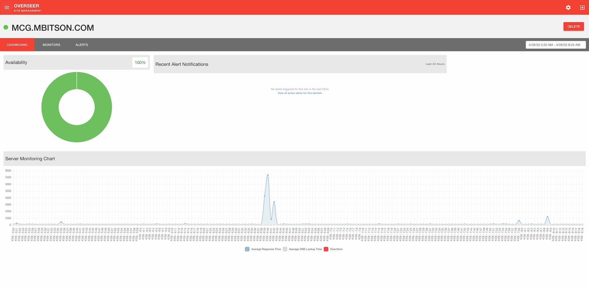

# Overseer


A site monitoring tool written in [Go](https://golang.org/) using [Beego](https://beego.me/quickstart). Frontend built with [AngularJS](https://angularjs.org/) & [Chart.js](https://www.chartjs.org/). 

This project was built for learning purposes. It is still in progress and likely will never be considered a finished product. I would recommend that you search for other Monitoring Servies should you need reliable monitoring on an application. Some of the software used in this project is outdated, and this project is not actively maintained.

## Installation
1) Manually install [Go 1.9.7+, 1.10.3+, or 1.11+](https://golang.org/)
2) Install Beego's "Bee" CLI Tool: 
    ```shell script
    go get github.com/beego/bee
    ```
    Please note that you must ensure your `$GOPATH/bin` is found in your `$PATH` in order to run `bee`.
3) Clone & init this repository:
    ```shell script
    git clone git@github.com:mbitson/overseer.git
    go mod init github.com:mbitson/overseer
    ```
4) Copy `app.conf.sample` to `app.conf` and cofigure the `appname` and `httpport`.
5) Run the program:
    ```shell script
    bee run
    ```
6) Reset admin user's defaulted password using the web UI: http://127.0.0.1:2020/ (unless port or host are changed in `app.conf`)

## Site Types
This system will attempt to understand the different types of applications you might have for a domain. You can create prebuilt checks which will monitor for application-specific flags. So far, the list of understood applications is:
- WordPress
- Magento 2
- Magento
- Generic / Static

## Todo
- Test this appplication with a custom `mysqlurls` value in `app.conf`
- Replace a static cron for site checks with a queue that allows variable check periods
- Implement alerts
- Implement contacts
- Implement raw data view
- Update navigation & "Sites needing attention" with WebSocket data

## Preview
[overseer.mbitson.com](https://overseer.mbitson.com)

